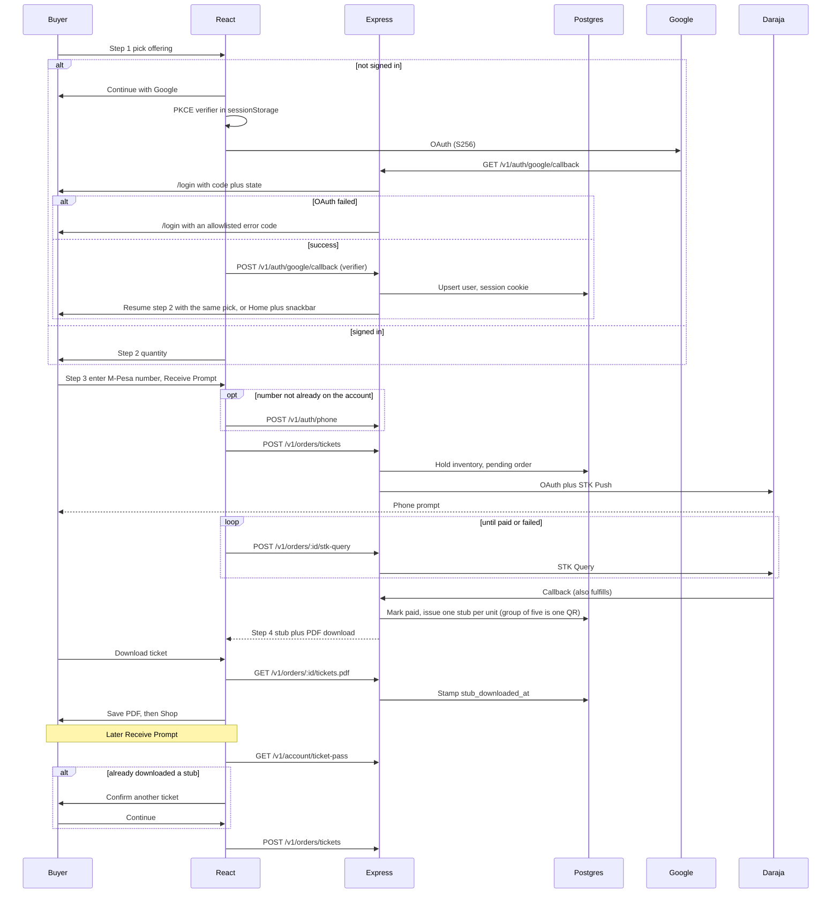

# Sherehe

Last updated: 2026-09-19 03:48 AM CDT

Food With Walter Kenya presents **Sherehe** — **Saturday 28 November 2026** at **Fused Lens Studios, Kirigiti, Kiambu**. Tickets, partners, vendors, catering bookings, and a small shop.

## Contents

- [Purpose](#purpose)
- [Prerequisites](#prerequisites)
- [Setup](#setup)
- [Usage](#usage)
- [Environment](#environment)
- [Deploy](#deploy)
- [Architecture](#architecture)
- [Troubleshooting](#troubleshooting)
- [Known limitations](#known-limitations)

## Purpose

Guests buy phased event tickets (Early Bird through VIIP, group of five, optional flash sale under 200 attendees) for the night at Fused Lens Studios. The header, home poster, ticket/vendor/partner flows, and PDF stubs show that date and studio. Partners and sponsors apply for review. Vendors pick a package and pay a fee. On the pick list each stall is a chit: category, name, fee, space, then labeled set-up / hours / pay-by, with operating rules quieter underneath. Customers can book FWW services (those bookings use the customer's own event date, not Sherehe's) and buy products. Payments go through M-Pesa STK Push (mock mode locally).

The public UI is a mobile-first barbecue pit: charcoal, flame, and sauce-pink, with a four-item bottom dock on phones (**Home**, **Tickets**, **Shop**, **You**). Sign-in has a three-gate toggle — **User**, **Partner**, **Vendor** — like Carelink’s portal switch. Google creates the account for that gate; the same Google email cannot enter a different gate later. Staff sign in on **User**. Light and dark palettes still follow the operating system. There is no theme toggle.

**Tickets** are four steps: pick, quantity, pay with M-Pesa, then download a charcoal pit PDF stub. **Shop** on the user and partner gates is a three-column food grid (nine plates a page, numbered pager). Tapping a plate opens the same quantity → M-Pesa → download receipt stepper; the paid row lands in **Records** on You. On the vendor gate, Shop is that stall’s own plates (add / edit / delete). Tapping a plate lists who bought it and the M-Pesa receipt — not checkout. The offering is locked after step one; a left-arrow back control returns to the previous page. A signed-out tap on step one stores that pick and sends the visitor to **Continue with Google**, then returns them to step two. Signing in from the Sign in screen with nothing saved lands on **Home**. Google stores the display name (shown on **You** above email and phone, and on stub/receipt lines). A Kenyan mobile is entered on **Receive Prompt** (country code **+254** plus nine spaced digits), not after Google. Sign out opens **Sign in**, not a signed-out holding page.

## Prerequisites

- Node.js 22+
- Docker (Postgres 16 on host port **5433**; 5432 is often already taken)
- npm 10+

## Setup

```bash
cp .env.example .env
docker compose up -d postgres
npm install
npm run migrate -w server
```

Staff bootstrap uses `STAFF_EMAIL`, `STAFF_PASSWORD`, and `STAFF_PHONE` from `.env` on first seed. Public sign-in is Google only — set `STAFF_EMAIL` to that Google account so the staff console is available after **Continue with Google** on the **User** gate (open **You → Staff**).

## Usage

One command (Postgres, migrate, API, Vite, opens your browser):

```bash
./start.sh
```

Logs land in `.local/state/sherehe-dev/`. If something else is listening on **5173** or **8787**, the script stops those processes first (SIGTERM, then SIGKILL). Ctrl+C stops the Node dev servers; Postgres keeps running in Docker.

Manual (two terminals):

```bash
npm run dev -w server
```

```bash
npm run dev -w client
```

Open http://localhost:5173 — Vite proxies `/v1` to the API on port 8787 (8080 is often already taken on this host).

Local checks (same as CI):

```bash
bash scripts/ci.sh
```

Buy a ticket while signed in: pick, quantity, **Receive Prompt**, then download the PDF. A group ticket is one QR for five people. Download stamps `stub_downloaded_at` on the paid order and then opens **Shop**. A later **Receive Prompt** asks to confirm another ticket if that stamp is already on file. With `MPESA_MODE=mock`, Daraja is skipped and the order is marked paid as soon as the STK step succeeds. Live mode uses Safaricom Daraja (OAuth token, STK Push, STK Query, and the HTTPS callback).

## Environment

| Variable | Purpose |
|---|---|
| `DATABASE_URL` | Postgres URL (Compose publishes Postgres on host port **5433**; Neon supplies this on Vercel) |
| `SESSION_SECRET` | Session cookie signing / id entropy companion |
| `TICKET_SIGNING_SECRET` | HMAC for ticket QR payloads |
| `CLIENT_ORIGIN` | CORS allowlist (Vite origin locally; the Vercel URL in production if unset) |
| `COOKIE_SECURE` | Set `true` behind HTTPS (defaults on when `NODE_ENV=production` or `VERCEL` is set) |
| `UPSTASH_REDIS_REST_URL` / `UPSTASH_REDIS_REST_TOKEN` | Upstash Redis (Vercel also accepts `KV_REST_API_*`). Required in production for rate limits and migrate locks |
| `STAFF_*` | Optional first staff user on seed; `STAFF_EMAIL` should match the Google account used to sign in |
| `GOOGLE_CLIENT_ID` / `GOOGLE_CLIENT_SECRET` | Google Cloud OAuth web client (required for sign-in) |
| `GOOGLE_REDIRECT_URI` | Optional override; default `{CLIENT_ORIGIN}/v1/auth/google/callback` |
| `MPESA_MODE` | `mock` or `live` |
| `MPESA_CONSUMER_KEY` / `MPESA_CONSUMER_SECRET` | Daraja app credentials (required when live) |
| `MPESA_SHORTCODE` / `MPESA_PASSKEY` | Paybill/till shortcode and STK passkey (required when live) |
| `MPESA_CALLBACK_URL` | Public **https** URL for `/v1/payments/mpesa/callback` (required when live) |
| `MPESA_ENV` | `sandbox` or `production` |

Never commit `.env`. Rotate Daraja keys in your secret manager; one credential set for this app.

## Deploy

The hosted app is a Vite static client plus an Express serverless function (`/v1`, `/health`). Neon holds Postgres. Upstash Redis holds sliding-window rate limits and a migrate lock. The Vercel project **sherehe** is already linked under team `kakaiteclimited-3896`. Session, ticket HMAC, Google OAuth, staff email, and `MPESA_MODE=mock` are already in the project env.

Marketplace installs need a human to accept terms (the CLI cannot do that in this session):

1. Neon: open [Accept Neon terms](https://vercel.com/kakaiteclimited-3896/~/integrations/accept-terms/neon?source=cli), then run:

   `vercel integration add neon --plan free_v3 -m region=fra1 -m auth=false --name sherehe-pg`

2. Upstash: open [Accept Upstash terms](https://vercel.com/kakaiteclimited-3896/~/integrations/accept-terms/upstash?source=cli), then run:

   `vercel integration add upstash/upstash-kv --plan free -m primaryRegion=fra1 -m autoUpgrade=false --name sherehe-redis`

3. Deploy: `vercel deploy --prod --yes`

Production is **https://sherehe-seven.vercel.app**.

4. In Google Cloud Console, add authorized JavaScript origin `https://sherehe.vercel.app` (or the URL `vercel ls` shows) and redirect `https://<that-host>/v1/auth/google/callback`.

5. For live M-Pesa, set `MPESA_MODE=live` and `MPESA_CALLBACK_URL=https://<that-host>/v1/payments/mpesa/callback` plus Daraja credentials.

Schema migrate/seed runs on the first serverless cold start (locked in Upstash). Local MySQL volumes are not used anymore; run `docker compose down` then `docker compose up -d postgres` after this change.

<sub>[↑ Back to contents](#contents)</sub>

## Architecture

Ticket sale windows and the flash-sale gate live in `server/src/sale/engine.ts` (unit tested). Checkout re-checks those rules inside a Postgres transaction with a 10-minute inventory hold.



Public routes: `/`, `/tickets`, `/shop`, `/account`, `/orders/:id`, `/login`. Partner/vendor application and services/staff screens remain at `/partners`, `/vendors`, `/services`, `/staff` (not on the dock).

## Troubleshooting

- **`./start.sh` times out:** read `.local/state/sherehe-dev/server.log` and `client.log`. Confirm Docker is running and port **5433** is free for Postgres.
- **API 500 on first request:** Postgres is not up or migrate has not run. `docker compose ps` then `npm run migrate -w server`.
- **CORS or CSRF 403:** Use the Vite origin (`http://localhost:5173`), not the API port, so cookies stay first-party via the proxy.
- **Live STK never completes:** Daraja must reach `MPESA_CALLBACK_URL` over HTTPS. The pay step also polls STK Query so a delayed callback can still settle. Locally use a tunnel, or keep `MPESA_MODE=mock` until that URL exists.
- **Flash sale missing:** Staff can arm it only when confirmed attendees are below 200. The public catalog hides flash when the window ends.
- **Continue with Google fails immediately:** set `GOOGLE_CLIENT_ID` and `GOOGLE_CLIENT_SECRET`, add authorized redirect `http://localhost:5173/v1/auth/google/callback`, then `npm run migrate -w server` if the Google columns are missing.
- **Google account picker works, then the app says sign-in expired:** click **Continue with Google** again from this tab (the PKCE verifier lives in sessionStorage). Do not reuse an old Google tab after a failed attempt.
- **Google account picker works, then the app says sign-in did not complete:** the API could not reach Google (`google_auth_failed` / `fetch failed` in `.local/state/sherehe-dev/server.log`). Retry; if a VPN is on, pause it or allow `oauth2.googleapis.com` and `www.googleapis.com`.

## Known limitations

- USSD (`*199#`) is out of scope.
- Refunds, email/SMS receipts, and a formal DPIA are not built.
- Load and mutation testing are deferred.
- Compose runs Postgres only; the Node apps run on the host.
- No user-facing appearance control (product requirement: follow system light/dark only; both palettes are the barbecue theme).
- Password registration is not in the UI; staff access is the seeded email matching a Google account.

<sub>[↑ Back to contents](#contents)</sub>
